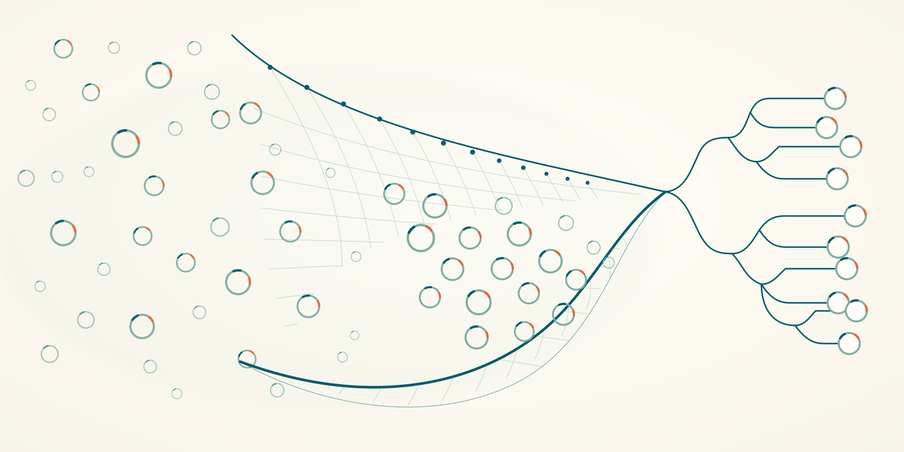

# MetaTrawl

<p align="center">
  
</p>

<p align="center">
  <a href="https://pypi.org/project/metatrawl/"></a>
  <a href="https://pypi.org/project/metatrawl/"></a>
  <a href="https://hub.docker.com/r/parsaghadermazi/metatrawl"></a>
  <a href="LICENSE"></a>
</p>

MetaTrawl is a workflow and data layer for large-scale strain analysis of
metagenomic samples. Starting from SRA run accessions or local reads, it manages
reference discovery, alignment, [ZipStrain](https://github.com/OlmLab/ZipStrain)
profiling, durable storage, genome-specific matrices, pairwise comparisons, and
interactive genome views.

It is designed for projects that outgrow collections of loose profile files.
Samples can be added over time, expensive stages can run locally or through
Slurm, and every sync command derives its remaining work from durable state.

## What MetaTrawl Provides

- **One project database.** Profile data, genome and gene statistics, Sylph
  abundance, sample state, and provenance live in DuckDB.
- **Incremental workflows.** Add samples and rerun the same commands; completed
  profiles, matrices, comparisons, and views are reused.
- **Controlled parallelism.** Configure workers, threads, memory, retries, and
  local or Slurm execution independently for each stage.
- **Shared reference caching.** Concurrent workers reuse downloaded genomes,
  Prodigal annotations, Bowtie2 indexes, and matrix requirement files.
- **Compact storage.** Choose complete positional profiles or allele-mask
  storage for projects focused on popANI.
- **Native ZipStrain outputs.** Per-genome HDF5 matrices and comparison DuckDB
  files remain usable through ZipStrain itself.
- **Analysis access.** Query the project through Python and Polars or generate
  self-contained genome views with heatmaps, dendrograms, clusters, and neighbor
  networks.

## Workflow

```text
SRA accessions or local FASTQs
            │
            ▼
  sync-profile ───────► DuckDB project store
            │              profiles · stats · abundance · provenance
            ▼
  matrix sync-build ──► one HDF5 matrix per genome
            │
            ▼
  matrix sync-compare ► one comparison DuckDB per genome
            │
            ▼
  sync-genome-views ──► static interactive genome bundles
```

ZipStrain defines the profile, matrix, ANI, IBS, and gene-comparison semantics.
MetaTrawl prepares references, runs external tools, writes ZipStrain-compatible
matrices, schedules comparisons, records provenance, and cleans temporary data.

## Installation

### Bioconda

Bioconda is the simplest installation for the complete workflow because it also
installs the external bioinformatics tools:

```bash
conda create -n metatrawl -c conda-forge -c bioconda metatrawl
conda activate metatrawl
metatrawl check
```

### PyPI

```bash
pip install metatrawl
```

The PyPI package installs Python dependencies. Sylph, Bowtie2, Samtools,
Prodigal, SRA Toolkit, and NCBI Datasets must be installed separately when their
workflow stages are used.

### Containers

Published images contain the complete toolchain:

```bash
# Portable CPU image
docker pull parsaghadermazi/metatrawl:1.0.0

# NVIDIA CUDA 12.8 image
docker pull parsaghadermazi/metatrawl:1.0.0-cuda
```

See [Container usage](docs/containers.md) for project mounts, CUDA checks,
GPU comparison commands, local builds, and Apptainer use on HPC.

## Quick Start

### 1. Create a project

```bash
metatrawl init --db metatrawl.duckdb
```

Register SRA runs from a metadata CSV containing a `Run` column:

```csv
Run,study_accession
SRR000001,SRP000001
SRR000002,SRP000001
```

```bash
metatrawl samples add-sra-ids \
  --db metatrawl.duckdb \
  --input-file samples.csv
```

Local paired or single-end reads can be registered without copying them:

```csv
sample_id,read_1,read_2
sample_001,/data/sample_001_R1.fastq.gz,/data/sample_001_R2.fastq.gz
sample_002,/data/sample_002.fastq.gz,
```

```bash
metatrawl samples add-reads \
  --db metatrawl.duckdb \
  --input-file local_reads.csv
```

### 2. Profile and import samples

```bash
metatrawl sync-profile \
  --db metatrawl.duckdb \
  --cache-dir cache \
  --scratch-dir scratch \
  --output-dir outputs \
  --sylph-db /path/to/gtdb.syldb \
  --workflow-config workflow.toml
```

Each completed sample is imported transactionally and then removed from scratch.
Rerunning the command resumes incomplete samples and skips imported samples.

### 3. Build genome matrices

```bash
metatrawl matrix sync-build \
  --db metatrawl.duckdb \
  --matrix-dir matrices \
  --bed-dir cache/beds \
  --stb-dir cache/stb \
  --gene-range-dir cache/gene_ranges \
  --sparse \
  --min-coverage 0.1 \
  --min-ber 0.7 \
  --workflow-config workflow.toml
```

### 4. Compare every matrix

```bash
metatrawl matrix sync-compare \
  --db metatrawl.duckdb \
  --matrix-dir matrices \
  --compare-dir compares \
  --calculate ani+gene \
  --ani-method popani \
  --backend numpy \
  --workflow-config workflow.toml
```

For NVIDIA acceleration, use the CUDA container and set
`--backend torch-cuda`.

### 5. Generate and serve genome views

```bash
metatrawl sync-genome-views \
  --db metatrawl.duckdb \
  --compare-dir compares \
  --view-dir genome_views \
  --workflow-config workflow.toml

metatrawl view genomes --view-dir genome_views
```

Open `http://127.0.0.1:8766`. The viewer reads static artifacts and does not
open the project or comparison databases.

For the complete walkthrough, including fixed references, threshold behavior,
manual imports, and progress inspection, read [Getting started](docs/getting-started.md).

## Storage Modes

| Project storage | Keeps | Matrix support | Downstream methods |
| --- | --- | --- | --- |
| `full` | Per-position A/C/G/T counts | Bitmask or counts | popANI, conANI, cosANI, IBS, gene ANI, profile queries |
| `allele-mask` | Covered-position and allele-set masks | Bitmask | popANI, IBS, and gene popANI |

Create an allele-mask project when positional counts will never be needed:

```bash
metatrawl init \
  --db metatrawl.duckdb \
  --profile-storage allele-mask \
  --profile-min-cov 5
```

Profiling itself remains unchanged. MetaTrawl converts the completed ZipStrain
profile during import and preserves genome stats, gene stats, Sylph abundance,
and provenance normally.

## Python API

```python
from metatrawl import open_database

db = open_database("metatrawl.duckdb")

samples = db.samples().collect()
genomes = db.genomes().collect()
stats = db.genome("GCF_000001").genome_stats().collect()

db.genome("GCF_000001").profiles().sink_parquet(
    "GCF_000001.profiles.parquet"
)
```

Queries can return Polars DataFrames, participate in lazy Polars pipelines, or
stream directly to Parquet. See the [Python query API](docs/python-api.md).

## Project Layout

| Path | Purpose | Durable? |
| --- | --- | --- |
| `metatrawl.duckdb` | Samples, profiles, stats, abundance, and provenance | Yes |
| `cache/` | Shared genomes, genes, indexes, and matrix inputs | Yes |
| `matrices/` | One resumable HDF5 matrix per genome | Yes |
| `compares/` | One resumable comparison DuckDB per genome | Yes |
| `genome_views/` | Static browser and analysis bundles | Regenerable |
| `scratch/`, `outputs/` | Per-sample checkpoints and pending imports | Temporary |

MetaTrawl only deletes sample scratch and published profile files after the
corresponding database import commits.

## Documentation

- [Getting started](docs/getting-started.md): complete CLI workflow
- [Containers](docs/containers.md): CPU, CUDA, Docker, and Apptainer
- [Sync and resume](docs/sync-and-resume.md): incremental execution model
- [Workflow configuration](docs/workflow-configuration.md): local and Slurm settings
- [Python query API](docs/python-api.md): sample and genome queries
- [Database provenance](docs/database-provenance.md): versioning and compatibility

## Support

Use [GitHub Issues](https://github.com/OlmLab/MetaTrawl/issues) for bug reports
and feature requests. Include `metatrawl --version`, the relevant workflow
configuration, and the `METATRAWL` log lines around a failure.

## Development

```bash
git clone https://github.com/OlmLab/MetaTrawl.git
cd MetaTrawl
pip install -e ".[test]"
pytest
```

MetaTrawl is released under the [MIT License](LICENSE).
